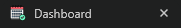
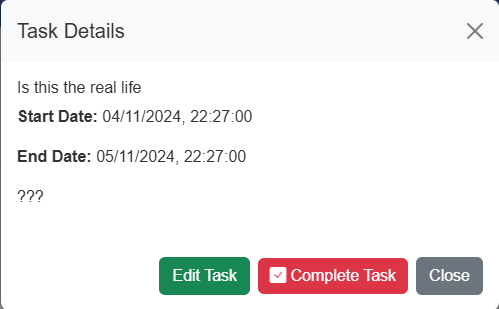

# Nights Team Planner - Milestone Project 3 - Backend Development.


This team planner/productivity app was created as my 3rd milestone project for my Level 5 Diploma in Web Development.

Link to deployed site: [Team Planner](https://nightsapp-mp3-95b6adbcde7b.herokuapp.com/)

## Contents

- [User Experience](#user-experience)

  - [Project Goals](#project-goals)
  - [User Stories](#user-stories)

- [Design](#design)

  - [Colour Scheme](#colour-scheme)
  - [Typography](#typography)
  - [Imagery](#imagery)
  - [Wireframes](#wireframes)
  - [Database Schema & User Journey](#database-schema--user-journey) -[User Journey](#user-journey)

- [Features](#features)

  - [Future Updates/Changes](#future-improvementschanges)

  - [Accessability](#accessibility)

- [How It Was Built](#how-it-was-built)

  - [Languages Used](#languages-used)
  - [Libraries, Websites & Programs Used](#libraries-websites--programs-used)

- [Deployment & Local Development](#deployment--local-development)

  - [Deployment](#deployment)
  - [Local Development](#local-development)

- [Testing](#testing)

  - [Solved Bugs](#solved-bugs)
  - [Known Bugs](#known-bugs)
  - [Issues](#issues)

- [Credits](#credits)

  - [Code Used](#code-used)
  - [Page Content](#page-content)
  - [Media](#media)
  - [Acknowledgements](#acknowledgements)

---

## User Experience

### Project Goals

The inspiration for this project happened quite early into my journey though the diploma. I thought to myself, wouldn't it be nice if I could solve the issue my team at work has with regards to planning and organizing our holidays within our team. Currently they're tracked on an excel spreadsheet which is fairly hard to follow along with - so this just felt like the right fit.

There are many ways in which I could potentially take the project further than it is, which we will explore a little later on.

### User Stories

#### _Target Audience_

The purpose of this site/app isn't really for public use. It's really intended to be more of a tool to be used within a professional environment. Likely something that would fit small teams (like the one I work on!)

#### _First Time Visitor Goals_

For a first time user, I would like:

- To be able to register for an account.
- To be able to navigate around the site with ease.
- Log out when I'm done.

#### _Returning Visitor Goals_

As a returning, registered user, I would like:

- To view/add tasks for myself.
- To request/update/check the status of my holiday.
- Complete/update any tasks I've finished or need to move.

#### _Admin User_

As an Admin, I would like to:

- View holiday requests from users.
- Approve/decline holiday requests.
- Manage my own tasks & holidays.
- Assign tasks to users. (Future Implementation)

---

## Design

### Colour Scheme

As this is intended on being a "professional" app, I didn't want the colours being too intrusive. I've gone with colours that compliment each other well, but remain understated and not detract from the site its self.


Some buttons I changed for the custom colour `#3b5998` rather than sticking with a default bootstrap colour - others I left with "success" and "danger" where it made sense to have them.

### Typography

For the sites Typography I went with Arial. As this font is available within the browser by default, I didn't need to do any specific imports for this one.


While there are many, many fonts around these days - Arial is one of the most widely used sans-sarif fonts, and for good reason!

- **Readability**: Arial is clear and easy to read, both in print and on digital screens. Its simple, clean design ensures that text is legible even at smaller sizes.

- **Neutral Appearance**: Arial has a neutral, modern look that doesn’t distract from the content. This makes it versatile for a variety of contexts, including professional documents, presentations, and websites.

- **Wide Availability**: Arial is a standard font that comes pre-installed on most operating systems and applications, making it universally accessible without the need for additional downloads or licensing.

- **Compatibility**: Since it’s widely available and widely supported, Arial ensures that documents look the same on different devices and platforms without font compatibility issues.

- **Good for Digital Content**: Arial’s simple structure is optimized for screen display. It works well for websites, emails, and mobile devices, where legibility and clarity are crucial.

- **Clean and Professional**: Its straightforward design gives a clean and professional appearance, suitable for business presentations, reports, and official communication.

- **Versatility**: Arial can be used across different design styles and document types, from formal to casual settings. Its legibility makes it a go-to choice for both small body text and larger headings.

- **Supports Multiple Languages**: Arial includes a broad range of characters, supporting various international languages and symbols, making it adaptable for global use.

### Imagery

As you can tell when using the site - It doesn't include many images at all. Again, this was by design. I've added a placeholder image for the login page that I found on Google from one of my favorite TV shows!

### Wireframes

Wireframes created for various viewports using Balsamiq.


### Database Schema & User Journey

#### User Journey


#### Database Schema


The database is relational. The primary table linking all of them would the User. Everything is tied directly to the user_id through primary & foreign keys. All tables will be created using Postgres.

---

## Features

The site in total contains 9 pages:

- Login Page (default view)
- Registration page
- Dashboard (login required)
- Add Task (login required)
- Edit Task (login required)
- Add Holiday (login required)
- Edit Holiday (login required)
- Approve Holiday (admin only)
- Custom error handlers (401, 404, 500)

### Common Features

- Navbar - The nav element was included in my base.html file, which is extended across the entire site. The majority of the links are wrapped in authentication which restricts access to the main site unless registered. The included image is a view of the "Admin" nav, which includes the additional "Approve Holiday" link.


- Favicon - Created using [Favicon.io](https://favicon.io/). I went with this image as it seemed suitable for the projects main point.



---

### Home/Login Page


Basic view of the login page displaying custom flash messages which also act as validation for user inputs. As you can see above, the password was intentionally input incorrectly to demonstrate. And also, the only visible navlink from this view is to take the user to the registration page. I added a button to direct the user to the registration page also, as I feel that this would be better UX for a mobile user.

### Register Page


While testing the site, I came across something that drove me around the bend! When adding new users, I would either forget the validation checks I have in place, or get my password wrong. This action, by default would empty the form causing me to start again! After many goes around of this, I decided to add conditions within the route for this page that will auto re-populate the fields previously filled in by the user (besides the password field.)

### Dashboard


This is the meat and potatoes of the site. This is where everything happens!

#### Tasks

 

The task section is specific to each individual user. The list is populated from the Task table, which is directly linked to the User table via the user_id foreign key. There is authentication & authorization wrapping the dashboard route for the tasks to be displayed. The task list is rendered in 3's - Once this limit is reached, a new page will be added. The tasks are dynamically added to the calendar based on the page your viewing rather than all tasks being rendered at the same time.

```
@views.route("/dashboard", methods=["GET"])
@login_required

tasks = Task.query.filter_by(user_id=current_user.id).all()
```

As you can see, the list item containing the details of each task also contains buttons. The edit button redirects to the edit task page, and complete task calls the delete task function from the views.py file.

**_I originally went with delete task, but I thought complete sounded better._**

There is also another way a user can interact with this functionality, and that is via a modal implemented within the calendar.



This has the same functionality as the buttons within the task its self - The main reason for implementing this was an issue I was having with tasks being treated as holidays within the calender when clicked on/interacted with, and if you tried to edit/delete it would cause a unwanted redirect. I do however feel that it is good UX, as the user might be within the calendar section and see a task that they want to deal with, and click it rather than referring back to the tasks specifically.

#### Add Task


This form is fairly self explanatory. All fields are listed as required within the form, and there is validation on the date ranges so you can't end before you start. I also added a character limit to the task field as during brute force testing, the app crashed due to the title being too long (specified within the database model for this column.)

```
        try:
            start_date = datetime.fromisoformat(start_date_str)
            due_date = datetime.fromisoformat(due_date_str)
        except ValueError:
            flash("Invalid date format.", "danger")
            return render_template("create_task.html",
                title=title,
                description=description,
                priority=priority,
                start_date=start_date_str,
                due_date=due_date_str,
                status=status)

        # validation that due is not before start date
        if due_date < start_date:
            flash("Due date cannot be before the start date.", "danger")
            return render_template("create_task.html",
                title=title,
                description=description,
                priority=priority,
                start_date=start_date_str,
                due_date=due_date_str,
                status=status)

        # Check if the title is within the "safe" limit of 200 characters
        if len(title) > 199:
            flash("Title is too long. Maximum of 200 characters.", "danger")
            return render_template("create_task.html",
                title=title,
                description=description,
                priority=priority,
                start_date=start_date_str,
                due_date=due_date_str,
                status=status)
```

The try/except block will take the string data of the dates and convert them into datetime objects for comparison. The except block likely won't be triggered due to how the dates are input, but it is good practice to consider these things regardless. The validation is handled through flash messages and the template is re-rendered with the users previous data.

The if & length check works very much the same way. Comparing the datetime objects and throwing a validation error via flash if needed.

**_At time of writing this, I didn't implement the re-rendering of this particular form.. Will update before the end!_**

#### Edit Tasks


I wanted to add "expected behavior" to this particular form - So as with the user registration page, the fields will pre-populate based on the given task the user is looking to edit.
