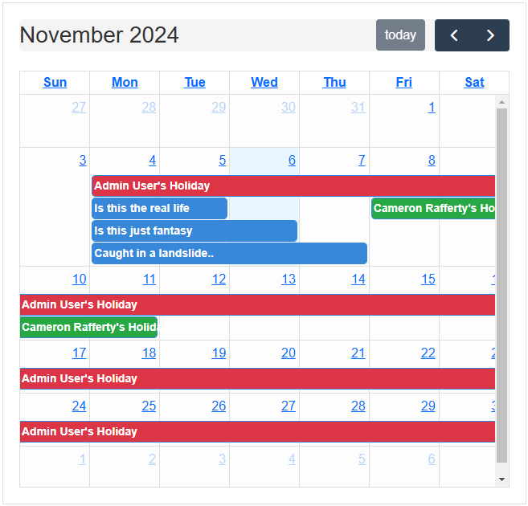

# Nights Team Planner - Milestone Project 3 - Backend Development.


This team planner/productivity app was created as my 3rd milestone project for my Level 5 Diploma in Web Development.

Link to deployed site: [Team Planner](https://nightsapp-mp3-95b6adbcde7b.herokuapp.com/)

## Contents

- [User Experience](#user-experience)

  - [Project Goals](#project-goals)
  - [User Stories](#user-stories)

- [Design](#design)

  - [Colour Scheme](#colour-scheme)
  - [Typography](#typography)
  - [Imagery](#imagery)
  - [Wireframes](#wireframes)
  - [Database Schema & User Journey](#database-schema--user-journey)

    - [User Journey](#user-journey)
    - [Database Schema](#database-schema)

- [Features](#features)

  - [Future Updates/Changes](#future-improvementschanges)
  - [Accessability](#accessibility)

- [How It Was Built](#how-it-was-built)

  - [Languages Used](#languages-used)
  - [Databases](#databases)
  - [Libraries & Packages](#libraries--packages)
  - [Programs Used](#programs-used)
    - [Flask Blueprints](#flask-blueprints)
    - [Flask-Login](#flask-login)
    - [Flask-SQLAlchemy & Database Models](#flask-sqlalchemy--database-models)
    - [Defensive Programming](#defensive-programming)
    - [Error Handling](#error-handling)
    - [Task and Holiday Management](#task-and-holiday-management)

- [Deployment & Local Development](#deployment--local-development)

  - [Deployment](#deployment)
  - [Local Development](#local-development)

- [Testing](#testing)

- [Credits](#credits)

  - [Code Used](#code-used)
  - [Page Content](#page-content)
  - [Acknowledgements](#acknowledgements)

---

## User Experience

### Project Goals

The inspiration for this project happened quite early into my journey though the diploma. I thought to myself, wouldn't it be nice if I could solve the issue my team at work has with regards to planning and organizing our holidays within our team. Currently they're tracked on an excel spreadsheet which is fairly hard to follow along with - so this just felt like the right fit.

There are many ways in which I could potentially take the project further than it is, which we will explore a little later on.

### User Stories

#### _Target Audience_

The purpose of this site/app isn't really for public use. It's really intended to be more of a tool to be used within a professional environment. Likely something that would fit small teams (like the one I work on!)

#### _First Time Visitor Goals_

For a first time user, I would like:

- To be able to register for an account.
- To be able to navigate around the site with ease.
- Log out when I'm done.

#### _Returning Visitor Goals_

As a returning, registered user, I would like:

- To view/add tasks for myself.
- To request/update/check the status of my holiday.
- Complete/update any tasks I've finished or need to move.

#### _Admin User_

As an Admin, I would like to:

- View holiday requests from users.
- Approve/decline holiday requests.
- Manage my own tasks & holidays.
- Assign tasks to users. (Future Implementation)

---

## Design

### Colour Scheme

As this is intended on being a "professional" app, I didn't want the colours being too intrusive. I've gone with colours that compliment each other well, but remain understated and not detract from the site its self.


Some buttons I changed for the custom colour `#3b5998` rather than sticking with a default bootstrap colour - others I left with "success" and "danger" where it made sense to have them.

### Typography

For the sites Typography I went with Arial. As this font is available within the browser by default, I didn't need to do any specific imports for this one.


While there are many, many fonts around these days - Arial is one of the most widely used sans-sarif fonts, and for good reason!

- **Readability**: Arial is clear and easy to read, both in print and on digital screens. Its simple, clean design ensures that text is legible even at smaller sizes.

- **Neutral Appearance**: Arial has a neutral, modern look that doesn’t distract from the content. This makes it versatile for a variety of contexts, including professional documents, presentations, and websites.

- **Wide Availability**: Arial is a standard font that comes pre-installed on most operating systems and applications, making it universally accessible without the need for additional downloads or licensing.

- **Compatibility**: Since it’s widely available and widely supported, Arial ensures that documents look the same on different devices and platforms without font compatibility issues.

- **Good for Digital Content**: Arial’s simple structure is optimized for screen display. It works well for websites, emails, and mobile devices, where legibility and clarity are crucial.

- **Clean and Professional**: Its straightforward design gives a clean and professional appearance, suitable for business presentations, reports, and official communication.

- **Versatility**: Arial can be used across different design styles and document types, from formal to casual settings. Its legibility makes it a go-to choice for both small body text and larger headings.

- **Supports Multiple Languages**: Arial includes a broad range of characters, supporting various international languages and symbols, making it adaptable for global use.

### Imagery

As you can tell when using the site - It doesn't include many images at all. Again, this was by design. I've added a placeholder image for the login page that I found on Google from one of my favorite TV shows!

### Wireframes

Wireframes created for various viewports using Balsamiq.


### Database Schema & User Journey

#### User Journey


#### Database Schema


The database is relational. The primary table linking all of them would the User. Everything is tied directly to the user_id through primary & foreign keys. All tables will be created using Postgres.

---

## Features

The site in total contains 9 pages:

- Login Page (default view)
- Registration page
- Dashboard (login required)
- Add Task (login required)
- Edit Task (login required)
- Add Holiday (login required)
- Edit Holiday (login required)
- Approve Holiday (admin only)
- Custom error handlers (401, 404, 500)

### Common Features

- Navbar - The nav element was included in my base.html file, which is extended across the entire site. The majority of the links are wrapped in authentication which restricts access to the main site unless registered. The included image is a view of the "Admin" nav, which includes the additional "Approve Holiday" link.


- Favicon - Created using [Favicon.io](https://favicon.io/). I went with this image as it seemed suitable for the projects main point.


---

### Site Logo/Heading


I made the conscious decision with the site logo to remove the `href=" "` from it - It didn't make sense to have it for this particular application as "normally" it routes you to your homepage/main page. For me, this is wrapped in authentication, so first time visitors might click it and get an unexpected outcome. I have added plenty of ways for the user to navigate around the site and get back to the homescreen/main page which I feel are more appropriate in the form of close/cancel buttons within each section a user would be looking to go or interact with. You will see examples of that when I describe the features further down the page.

### Home/Login Page


Basic view of the login page displaying custom flash messages which also act as validation for user inputs. As you can see above, the password was intentionally input incorrectly to demonstrate. And also, the only visible navlink from this view is to take the user to the registration page. I added a button to direct the user to the registration page also, as I feel that this would be better UX for a mobile user.

### Register Page


While testing the site, I came across something that drove me around the bend! When adding new users, I would either forget the validation checks I have in place, or get my password wrong. This action, by default would empty the form causing me to start again! After many goes around of this, I decided to add conditions within the route for this page that will auto re-populate the fields previously filled in by the user (besides the password field.)

### Dashboard


This is the meat and potatoes of the site. This is where everything happens!

#### Tasks

 

The task section is specific to each individual user. The list is populated from the Task table, which is directly linked to the User table via the user_id foreign key. There is authentication & authorization wrapping the dashboard route for the tasks to be displayed. The task list is rendered in 3's - Once this limit is reached, a new page will be added. The tasks are dynamically added to the calendar based on the page your viewing rather than all tasks being rendered at the same time.

```
@views.route("/dashboard", methods=["GET"])
@login_required

tasks = Task.query.filter_by(user_id=current_user.id).all()
```

As you can see, the list item containing the details of each task also contains buttons. The edit button redirects to the edit task page, and complete task calls the delete task function from the views.py file.

**_I originally went with delete task, but I thought complete sounded better._**

There is also another way a user can interact with this functionality, and that is via a modal implemented within the calendar.


This has the same functionality as the buttons within the task its self - The main reason for implementing this was an issue I was having with tasks being treated as holidays within the calender when clicked on/interacted with, and if you tried to edit/delete it would cause a unwanted redirect. I do however feel that it is good UX, as the user might be within the calendar section and see a task that they want to deal with, and click it rather than referring back to the tasks specifically.

#### Add Task


This form is fairly self explanatory. All fields are listed as required within the form, and there is validation on the date ranges so you can't end before you start. I also added a character limit to the task field as during brute force testing, the app crashed due to the title being too long (specified within the database model for this column.)

```
        try:
            start_date = datetime.fromisoformat(start_date_str)
            due_date = datetime.fromisoformat(due_date_str)
        except ValueError:
            flash("Invalid date format.", "danger")
            return render_template("create_task.html",
                title=title,
                description=description,
                priority=priority,
                start_date=start_date_str,
                due_date=due_date_str,
                status=status)

        # validation that due is not before start date
        if due_date < start_date:
            flash("Due date cannot be before the start date.", "danger")
            return render_template("create_task.html",
                title=title,
                description=description,
                priority=priority,
                start_date=start_date_str,
                due_date=due_date_str,
                status=status)

        # Check if the title is within the "safe" limit of 200 characters
        if len(title) > 199:
            flash("Title is too long. Maximum of 200 characters.", "danger")
            return render_template("create_task.html",
                title=title,
                description=description,
                priority=priority,
                start_date=start_date_str,
                due_date=due_date_str,
                status=status)
```

The try/except block will take the string data of the dates and convert them into datetime objects for comparison. The except block likely won't be triggered due to how the dates are input, but it is good practice to consider these things regardless. The validation is handled through flash messages and the template is re-rendered with the users previous data.

The if & length check works very much the same way. Comparing the datetime objects and throwing a validation error via flash if needed.

#### Edit Tasks


I wanted to add "expected behavior" to this particular form - So as with the user registration page, the fields will pre-populate based on the given task the user is looking to edit.

### Holidays - Main view



The calendar is where all of the user interaction with holiday objects occurs. "Holiday Request" is part of the authenticated navbar for all registered users, which will allow them to submit a holiday for approval. Once submitted, it will appear on the calendar within the chosen date range, showing as orange (pending). A full breakdown of the R.A.G system for holidays is outlined in the holiday request/edit forms.


As a user can request a holiday for any reason, the only requirements I've added are the start and end dates.


I added some basic validation checks to the start & end dates to ensure the holiday didn't end before it started.

**_For planning purposes, you CAN add a holiday that starts & ends in the past, as long as the start & end date are done correctly. Use case for something like this would be if someone went off sick, but decided to take the time off as holiday, rather than sick_**

### Holidays - Modal

The holiday modal represents the main interactivity done on the holiday objects. A user can edit and delete requests via interacting with the specific request. The modal will also display the relevant content - in the case of a holiday that would be the start and end date.

#### Edit Holiday


Interacting with the object pops the model, and the edit button will sent the user to the edit_holiday page/route.

#### Delete Holiday


I added Sweetalerts2 to replace the default browser alerts to deal with deleting holidays (and tasks) through the modal view on the calendar.

##### Holiday User Validation


If a user attempts to interact with a holiday not requested by themselves they'll trigger a warning alert - this validation has been added to the edit and delete routes.

```
if not current_user.is_admin and holiday.user_id != current_user.id:
        flash("You are not authorized to delete this holiday request.", "danger")
        return redirect(url_for("views.dashboard"))
```

**_Admins can delete/update holiday requests regardless of user access restrictions_**

#### Resubmit Required


This is a feature I wanted to add, just based off of personal experience dealing with peoples holiday shenanigans. When a request that has already been dealt with by an admin (approved/declined) is edited in any way, it then is returned to pending and will require re-reviewing by an admin. This is to stop people from changing the dates on authorized holidays to something else mainly.

### Approve Holiday (Admin Only)


This is the table that appears on the admin only route for Approve Holidays. However many holiday requests are pending will populate the table, and the admin can accept/decline them as appropriate! This will adjust the colour coding of the task in the calendar to represent approved/declined.

### Error Handlers


I've added some customer error handlers for common errors (401, 404 and 500) to deal with them in a more elegant way that just crashing the app.

---

## Future Updates/Changes

There are a number of changes/improvements I would make to the site/app that are outside of the scope of this project - IF my team do decide they would like to make use of the app, I would likely look to implement:

- Push/Email notifications for Admins/Users for holiday submissions & approvals.
- Giving Admin user the ability to create and assign tasks to specific users.
- Add further authentication surrounding general users. Only allowing people with certain email addresses (my company) to register accounts.
- Forgotten password/Password recovery.
- User profiles
- More accurate holiday tracking - our company gives holiday time in hours - allowing users to add there total hours of time off and deduct from the total when requests are made.
- As the amount of holidays on the calendar grows, it might be worth considering the impact on site performance and render them in blocks - 3 months at a time? Or just render the month being displayed currently.

### Accessibility

I have been mindful during coding to ensure that the website is as accessible friendly as possible. This has been have achieved by:

- Using semantic HTML.
- Using descriptive alt attributes on images on the site.
- Providing information for screen readers where there are icons used and no text.
- Ensuring that there is a sufficient colour contrast throughout the site.

---

## How It Was Built

### Languages Used

- HTML
- CSS
- JavaScript
- Python

### Databases

- [PostgresSQL](https://www.postgresql.org/) - Relational Database used to store all tables for the project.

### Frameworks

- [Flask](https://pypi.org/project/Flask/) - A micro framework for building websites in Python.

### Libraries & Packages

- [SweetAlert2](https://sweetalert2.github.io/) - Used to replace the default browser alerts.
- [Bootstrap v5.3](https://getbootstrap.com/) - CSS framework.
- [FullCalendar](https://fullcalendar.io/) - Calendar library.
- [Flask-Login](https://flask-login.readthedocs.io/en/latest/) - Flask-Login is an extension for Flask that provides user session management, handling tasks like login, logout, and user authentication in web applications.
- [SQLAlchemy](https://flask-sqlalchemy.readthedocs.io/en/stable/) - SQLAlchemy is a Python SQL toolkit and Object-Relational Mapping (ORM) library that simplifies database interaction by allowing developers to work with relational databases using Python objects.

### Programs Used

- [Pip](https://pypi.org/project/pip/) - Used for installing Python packages.
- [Jinja](https://jinja.palletsprojects.com/en/stable/) - Templating engine for Python.
- [Balsamiq](https://balsamiq.com/) - Used to create wireframes.
- [Git](https://git-scm.com/) - Used for version control.
- [Github](https://github.com/) - Used to save and store the file repository for the project.
- [Chrome Dev Tools](https://developer.chrome.com/docs/devtools/) - Used to troubleshoot & test responsive behavior.
- [Favicon.io](https://favicon.io/) - Used to generate the Favicons for the site.
- [Am I Responsive?](https://ui.dev/amiresponsive) - Used to generate images of website over different viewports.
- [Gitpod](https://www.gitpod.io/) - IDE used (Provided by Code Institute).
- [ERD DB Designer](https://erd.dbdesigner.net/login) - Used to provide visual representation of my DB and relationships for Readme.

---

### Flask Blueprints

In my project, I've utilized **Flask Blueprints** to logically organize and modularize the routes of my app. Blueprints allow me to separate the user authentication routes and the task/holiday-related routes into distinct sections. By organizing the code this way, it’s easier to maintain and scale the app as it grows. For example, all authentication-related routes are housed under the `auth` blueprint, and all task and holiday management routes are placed in the `views` blueprint. This way, my application is more manageable and follows a cleaner structure.

---

### Flask-Login

For handling user authentication, I integrated **Flask-Login**, a powerful extension that simplifies session management. With Flask-Login, I can easily log users in, protect routes from unauthorized access, and manage the login state.

- **User Registration**: During registration, users provide their email, first name, last name, and password. The password is securely hashed before being stored in the database.
- **User Login**: On the login page, users can authenticate with their email and password. If the login credentials are correct, they are granted access to the dashboard.

- **Logout**: The application also includes a logout route that allows users to end their session, securely logging them out.

- **Protected Routes**: Certain routes, like the dashboard and task creation, are protected using `@login_required`. This ensures that only authenticated users can access them.

---

### Flask-SQLAlchemy & Database Models

I’ve used **Flask-SQLAlchemy** to interact with a relational database. The database stores users, tasks, and holiday requests. The database models are organized as follows:

- **User Model**: Stores user information such as their first name, last name, email, and password. It also tracks whether the user is an admin or not.

- **Task Model**: Manages tasks assigned to each user, storing details like title, description, status, priority, and the associated start and due dates.

- **Holiday Model**: Allows users to request holidays. It tracks the start and end dates of the holiday, along with approval or decline status.

With Flask-SQLAlchemy, I can easily query and manipulate the database, ensuring smooth functionality for managing users, tasks, and holiday requests.

---

### Defensive Programming

**Defensive programming** is implemented throughout the application to prevent unauthorized users from making changes to data they do not own. For example, in the task and holiday management routes, I check whether the logged-in user is the one who created the task or holiday request before allowing any edits or deletions.

If a user tries to edit or delete a resource they don't own, a flash message is shown, informing them that they are not authorized to perform the action. Additionally, I’ve added a check for users with admin privileges, granting them access to all tasks and holiday requests, even if they didn't create them. This way, admins can manage all content across the application.

---

### Error Handling

To improve the user experience and make the app more resilient, I implemented **custom error handling** for common HTTP errors like 404 (Page Not Found) and 500 (Internal Server Error). Using a custom blueprint for error handling, I can customize how different errors are displayed to the user. This makes the application more user-friendly by showing specific messages and guidance when an error occurs.

For instance:

- A **404 error** redirects users to a custom page with a helpful message instead of a generic browser error page.
- A **500 error** displays a message indicating an internal server problem, while logging the error for future debugging.

---

### Task and Holiday Management

The core of the app revolves around managing **tasks** and **holiday requests**:

- **Task Management**: Users can create, edit, and delete tasks. Tasks have various attributes, such as title, description, status, priority, start date, and due date. Additionally, I’ve implemented pagination for the tasks displayed on the dashboard, ensuring that users can navigate through their tasks efficiently.

- **Holiday Requests**: Users can request holidays by specifying the start and end dates. Admins are able to approve or decline these holiday requests. The app ensures that holidays cannot be requested with invalid dates, and it includes checks to ensure that the start date is before the end date.

---

## Deployment & Local Development

### Deployment

<summary>Heroku Deployment Instructions</summary>

The site is deployed using Heroku. To deploy to Heroku:

1. To successfully deploy on Heroku we first need to create some files: a requirements.txt file and a Procfile.

2. The requirements.txt file contains all the applications and dependencies that are required to run the app. To create the requirements.txt file run the following command in the terminal:

   ```bash
   pip3 freeze --local > requirements.txt
   ```

3. The Procfile tells Heroku which files run the app and how to run it. To create the Procfile run the following command in the terminal:

   ```bash
   echo web: python run.py > Procfile
   ```

   NOTE: The Procfile uses a capital P and doesn't have a file extension on the end.

4. If the Procfile has been created correctly it will have the Heroku logo next to it. It is also important to check the Procfile contents, as sometimes on creation a blank line will be added at the end of the file. This can sometimes cause problems when deploying to Heroku, so if the file contains a blank line at the end, delete this and save the file. Make sure to save both these files and then add, commit and push them to GitHub.

5. Login (or sign up) to [Heroku.com](https://www.heroku.com).

6. Click the new button and then click create new app.

7. You will then be asked to give your app a name (these must be unique so you cannot reuse bookworm) and select a region. Once these are completed click create app.

8. You will now need to connect the Heroku app to the GitHub repository for the site. Select GitHub in the deployment section, find the correct repository for the project and then click connect.

9. Once the repository is connected, you will need to provide Heroku some config variables it needs to build the app. Click on the settings tab and then click reveal config vars button. You will now need to add the environment key/value variables that were used in the env.py file:

   | KEY          | VALUE             |
   | :----------- | :---------------- |
   | IP           | 0.0.0.0           |
   | PORT         | 5000              |
   | SECRET_KEY   | YOUR_SECRET_KEY\* |
   | DATABASE_URL | POSTGRES_DB\*     |

   \*Denotes a value that is specific to your app.

10. You're now ready to click the enable automatic deploys and create button. Heroku will start building the app.

11. As this project utilises a relational database, there are a few more steps to set this up.

12. On the heroku dashboard go to resources tab and then select add-ons. You will need to search for and select heroku postgres. For this project the hobby dev free tier is fine.

13. Go back into settings and reveal config vars. You should now see a new key called DATABASE_UL and the value should have been pre-populated.

14. We will now need to go the more button on the dashboard and select run console. This is where we will set up the tables in the database we have just created.

15. Type python3 and then once the python interpreter opens, we can run the following:

    ```bash
    from nightsapp import db
    db.create_all()
    exit()
    ```

16. Now that the relational database has been set up and the tables created, we can now click open app and the nightsapp application should now open in a new tab.
</details>

## Local Development

#### How to Fork

To fork the repository:

1. Log in (or sign up) to Github.

2. Go to the repository for this project, [Nightsapp](https://github.com/mnevison/mp-tres).

3. Click the Fork button in the top right corner.

#### How to Clone

To clone the repository:

1. Log in (or sign up) to GitHub.

2. Go to the repository for this project, [Nightsapp](https://github.com/mnevison/mp-tres).

3. Click on the code button, select whether you would like to clone with HTTPS, SSH or GitHub CLI and copy the link shown.

4. Open the terminal in your code editor and change the current working directory to the location you want to use for the cloned directory.

5. Type the following command in the terminal (after the git clone you will need to paste the link you copied in step 3 above):

   ```bash
   git clone { & THE LINK FROM STEP 3 }
   ```

6. Set up a virtual environment (this step is not required if you are using the Code Institute Template in GitPod as this will already be set up for you).

7. Install the packages from the requirements.txt file by running the following command in the Terminal:

   ```bash
   pip3 install -r requirements.txt
   ```

---

## Testing

Please see [TESTING.md](TESTING.md) for all testing performed

---

## Credits

### Code Used

- [Tech With Tim - Flask Tutorial](https://www.youtube.com/watch?v=dam0GPOAvVI&t=25s) - This video was very helpful when I was getting started with the project as it helped me understand and implement the auth side of the app.
- Relational DB Walkthrough via Code Institute - Prior to going ahead with the project, we did a walk through using flask. I referred back to the repo from this project again when getting up and running.

### Page Content

Content for this page was written by Mark Nevison.

### Acknowledgements

- [Darren](https://github.com/monkphin/) - Massive thanks for all the help with the project in general, but very much the DB guruing!
- [Cameron](https://github.com/CamRaff) - Once again, being a massive bro - top notch sounding board!
- Jubril Akolade - My Code Institute mentor.
- UCP-15 Discord - For always providing feedback on my project.
