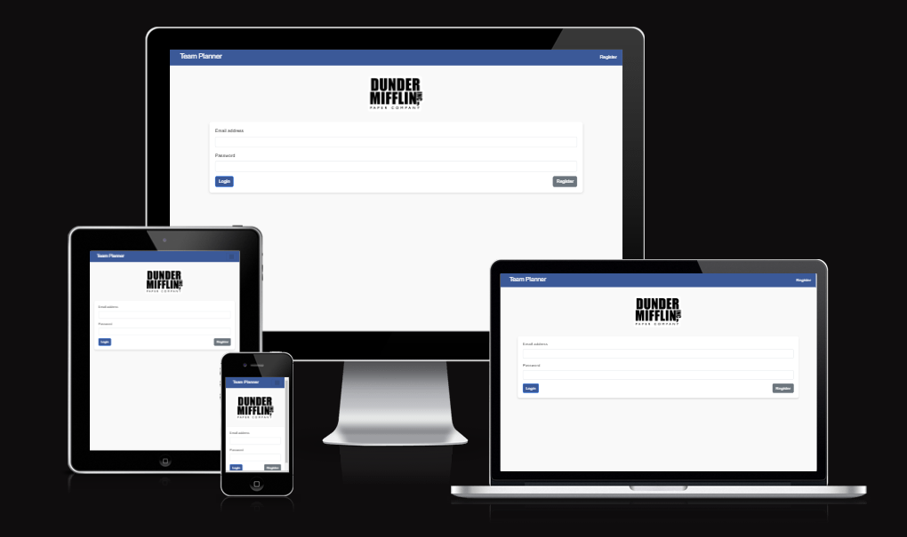

# Nights Team Planner - Milestone Project 3 - Backend Development.



This team planner/productivity app was created as my 3rd milestone project for my Level 5 Diploma in Web Development.

Link to deployed site: [Team Planner](https://nightsapp-mp3-95b6adbcde7b.herokuapp.com/)

## Contents

- [AUTOMATED TESTING](#automated-testing)

  - [W3C Validator](#w3c-validator)
  - [CSS Jigsaw](#css-jigsaw)
  - [JavaScript Validator](#javascript-validator)
  - [Python Validator](#python-validator)
  - [Lighthouse](#lighthouse)

- [MANUAL TESTING](#manual-testing)

  - [Testing User Stories](#testing-user-stories)
  - [Full Testing](#full-testing)

- [BUGS]

  ***

  ## Automated Testing

  ### W3C Validator

  [W3C](https://validator.w3.org/) was used to validate the HTML on all pages of the website. Due to my app not working in the regular way, I've had to do it via direct input.

  - [Login Page](/docs/testing/w3c%20-%20html/w3c-login.png) - 1 error. The error is related to a bootstrap class added on for styling purposes. I'm happy to let this error sit.
  - [Register](/docs/testing/w3c%20-%20html/w3c-register.png) - No errors.
  - [Dashboard](/docs/testing/w3c%20-%20html/w3c-dashboard.png) - No errors. Warnings are from elements that are dynamically rendered, so may sometimes appear empty.
  - [Create Task](/docs/testing/w3c%20-%20html/w3c-createtask.png) - Corrected the initial errors I was getting regarding the <options> tag. I needed to add a placeholder before my own custom ones. No errors now.
  - [Edit Task](/docs/testing/w3c%20-%20html/w3c-edittask.png) - Corrected the initial errors I was getting regarding the <options> tag. I needed to add a placeholder before my own custom ones. No errors now.
  - [Holiday Request](docs/testing/w3c%20-%20html/w3c-holidayrequest.png) - No errors.
  - [Edit Holiday](/docs/testing/w3c%20-%20html/w3c-editholiday.png) - No errors.
  - [Admin Approval](/docs/testing/w3c%20-%20html/w3c-adminapprove.png) - No errors.

  ### CSS Jigsaw

  [CSS Validator](https://jigsaw.w3.org/css-validator/) Jigsaw was used to validate my styles.css file.

  - [CSS Jigsaw](/docs/testing/w3jigsaw/w3-jigsaw.png) - No errors.

  ### JavaScript Validator

  [JSHint](https://jshint.com/) was used to validate the JavaScript across the site.

  - [script.js](/docs/testing/jshint/jshint-script.png) - No issues. Unused variables are from Sweetalert2.
  - [dashboard](/docs/testing/jshint/jshint-dashboard.png) - No issues. Unused variables refer to FullCalendar & Bootstrap.

  **_I had to inline a good portion of my JavaScript due to using Jinja to loop through my tasks and holidays. To get the validator to provide some results that weren't just full of errors caused by Jinja, I removed that section totally and just essentially added the code related to the calendar & modal functionality - Below you will see the "taskEvents" and "holidayEvents" variables missing from the above file_**

  ```
  document.addEventListener('DOMContentLoaded', function() {
      let taskEvents = [
          
          {
              title: "{{ task.title|escape }}",
              start: "{{ task.start_date.strftime('%Y-%m-%dT%H:%M:%S') }}",
              end: "{{ task.due_date.strftime('%Y-%m-%dT%H:%M:%S') }}",

              extendedProps: {
                  type: 'task',
                  description: "{{ task.description|escape }}",
                  editUrl: "{{ url_for('views.edit_task', task_id=task.id) }}",
                  deleteUrl: "{{ url_for('views.delete_task', task_id=task.id) }}"
              }
          },
          
      ];

      let holidayEvents = [
          
          {
              title: "{{ holiday.owner.fname if holiday.owner else 'Unknown' }} {{ holiday.owner.lname if holiday.owner else '' }}'s Holiday",
              start: "{{ holiday.start_date.strftime('%Y-%m-%dT%H:%M:%S') if holiday.start_date else '' }}",
              end: "{{ holiday.end_date.strftime('%Y-%m-%dT%H:%M:%S') if holiday.end_date else '' }}",
              type : 'holiday',
              extendedProps: {
                  description: "Holiday: {{ holiday.description|escape if holiday.description else '' }} (Pending Approval)",
                  isDeclined:  true  false ,
                  isApproved:  true  false ,
                  editUrl: "{{ url_for('views.edit_holiday', holiday_id=holiday.id) }}",
                  deleteUrl: "{{ url_for('views.delete_holiday', holiday_id=holiday.id) }}"
              },
              backgroundColor:
                
                  "#28a745"
                
                  "#dc3545"
                
                  "#ffc107"
                
            },
            
      ];
  ```

  ### Python Validator

  [CI Python Linter](https://pep8ci.herokuapp.com/) was used to validate the Python code for pep8 compliance. All but 1 error I was able to correct during initial testing, and have now fully cleared all errors.

  - [run.py](/docs/testing/pep8/run-pep8.png) - No errors.
  - [init.py](/docs/testing/pep8/init-pep8.png) - No errors.
  - [views.py](/docs/testing/pep8/views-pep8.png) - 1 error, mentioned above. Correction below.
  - [auth.py](/docs/testing/pep8/auth-pep8.png) - No errors.
  - [models.py](/docs/testing/pep8/models-pep8.png) - No errors.
  - [database.py](/docs/testing/pep8/db-pep8.png) - No errors.
  - [errors.py](/docs/testing/pep8/errors-pep8.png)

  **_Below is the line of code causing the issue in views.py with in it's corrected format_**

  

  ### Lighthouse

  I used Lighthouse within the Chrome Developer Tools to test the performance, accessibility, best practices and SEO of the website.

  **_As the majority of the website is just various forms, I was noticing the majority of results were the same. Rather than posting the tests from everything, I'm just going to show the results I got from my "Dashboard" - The hub of the site that contains the most information that may have the biggest impact on things like performance_**

  #### Dashboard Desktop

  

  #### Dashboard Mobile

  

---

## Manual Testing

### Testing User Stories

**_First Time User Goals_**

| Goal                                             |                 Test                 | Outcome                                           |
| :----------------------------------------------- | :----------------------------------: | :------------------------------------------------ |
| To be able to register for an account            |       Register for an account        | Successfully make a new account for the app       |
| To be able to navigate around the site with ease | Click the navigation links & buttons | Routed to desired area of site                    |
| Log out when I'm done                            |  Press "Logout" button on Dashboard  | I was logged out and returned to the login screen |

**_Returning Visitor Goals_**

| Goal                                                    |                  Test                  | Outcome                                                                                                                       |
| :------------------------------------------------------ | :------------------------------------: | :---------------------------------------------------------------------------------------------------------------------------- |
| To view/add tasks for myself                            |              Added a task              | The task was added then displayed on the Dashboard view                                                                       |
| To request/update/check the status of my holiday        |          Requested a holiday           | Holiday rendered within the calendar across chosen dates                                                                      |
| Complete/update any tasks I've finished or need to move | Edited a task - Once edited, completed | The task updated - date ranges changed. Calendar view updated. Once completed, task was removed from the task view & calendar |

### Full Testing

#### Navbar Authentication


#### Login


#### Logout


#### Register Nav Link


#### Register (Account Creation)


#### Register (Email Validation)


#### Registration Form Auto Fill


#### New Task Link/Button


#### Create New Task


#### Edit Task Link


#### Edit Task


#### Complete/Delete Task


#### Task Edit (Modal)


#### Task Delete/Complete (Modal)


#### Request Holiday Nav


#### Request Holiday


#### Holiday Edit/Update Link


#### Holiday Update


#### Holiday Delete


#### Holiday Authentication


#### Holiday Status Update


#### Admin Holiday Approval


---

## Bugs

As of right now, the site has no known bugs.

I didn't really experience any "bugs" during development - I experienced more "user error", which was typically solved using the flask default debugging tool.
